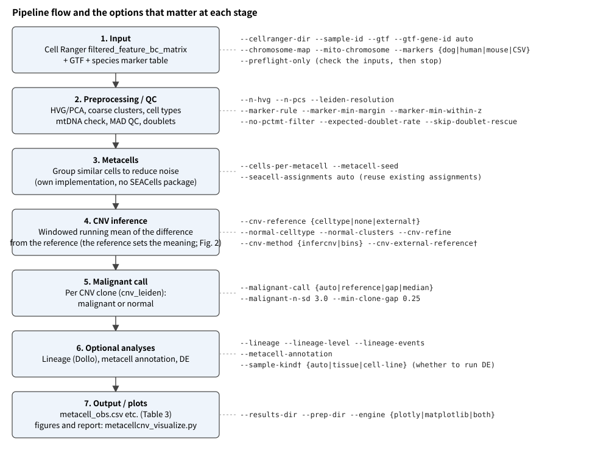
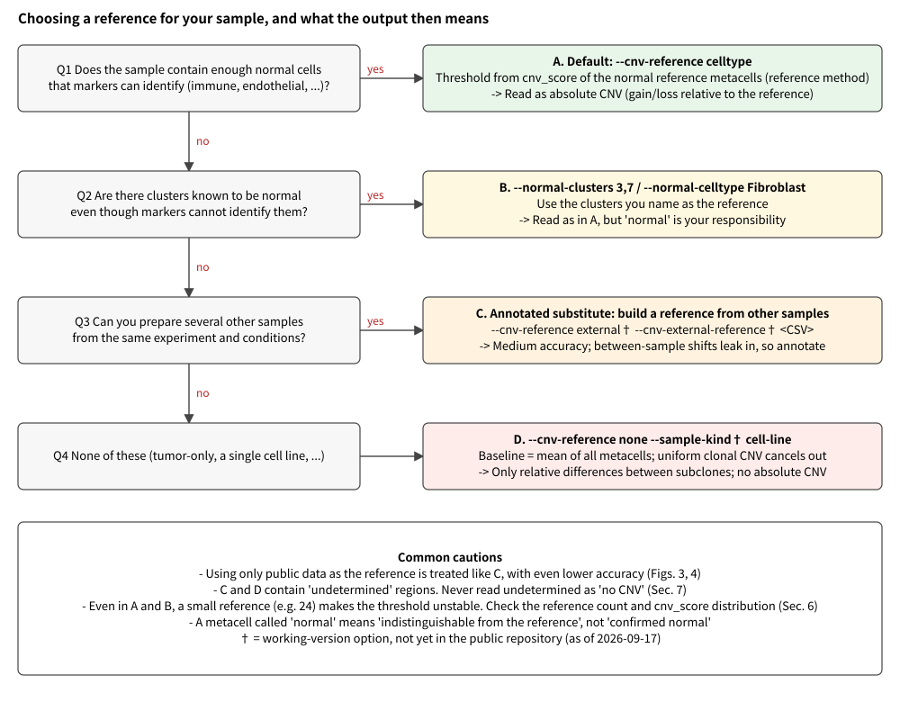
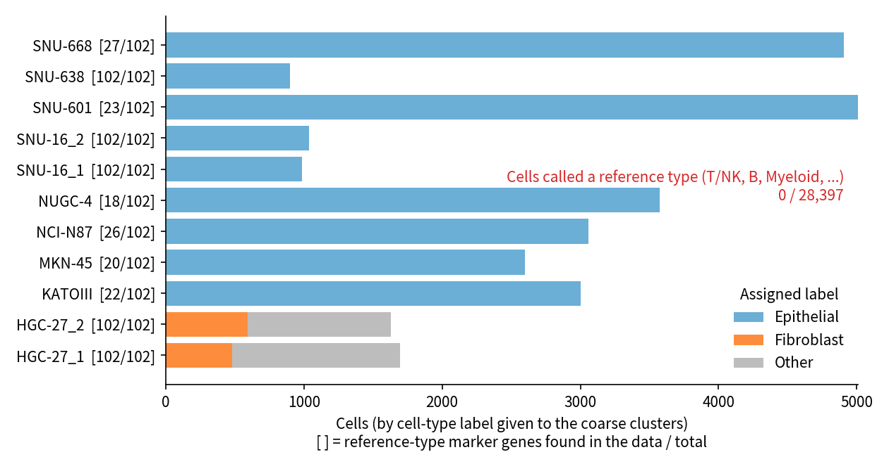
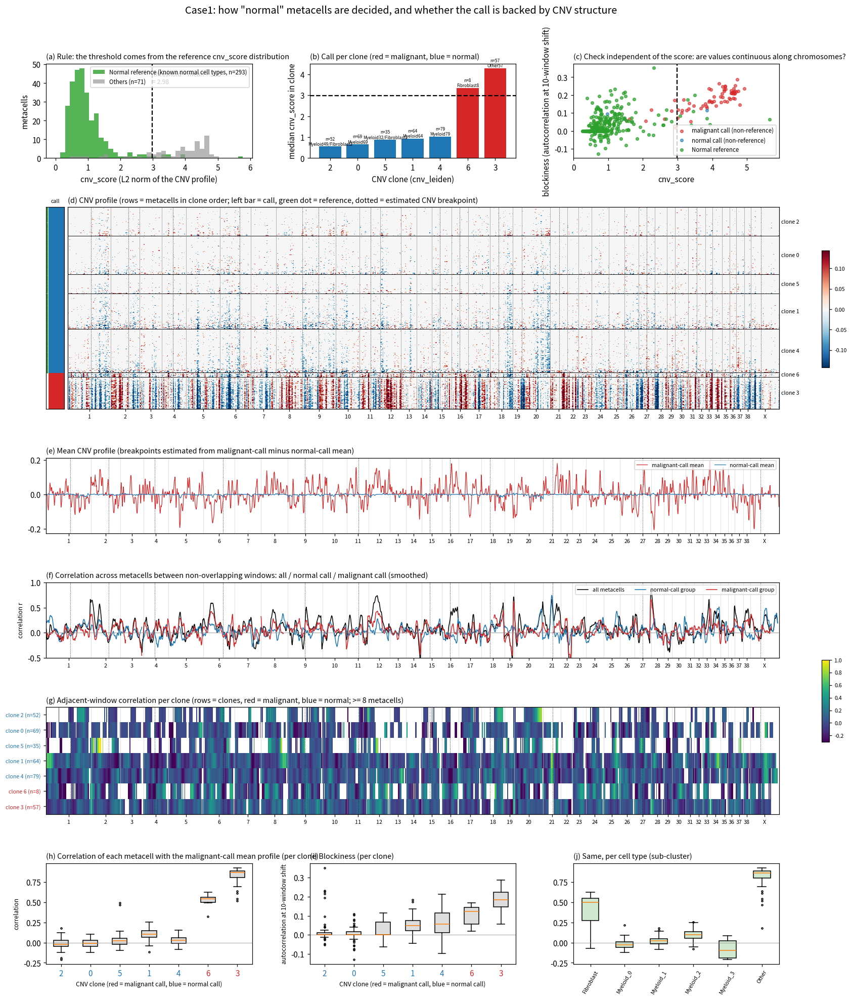
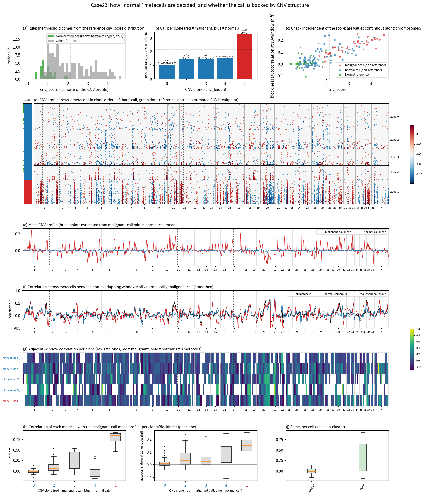
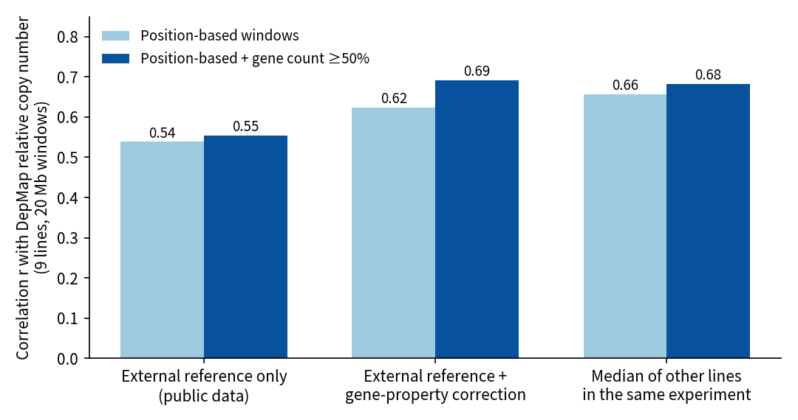
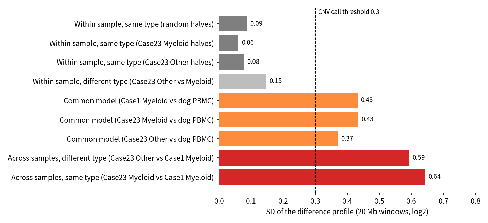

# metacellcnv User Guide

**Starting from Cell Ranger output: which options to use, how to run, and what the output then means.**

The pipeline now has several processing and calibration steps. This guide lays them out in the order "input → choice → meaning of the output".
If you only want the conclusions, read Sec. 3 (choosing a reference) and Sec. 8 (checklist for reading results).

日本語版: [index_jp.html](index_jp.html) / [pipeline_guide.md](pipeline_guide.md)

## 0. How to read this guide

- **Version covered**: the working version of `metacellcnv.py` (as of 2026-10-09). Option names and defaults were checked against `--help` and the code. On 2026-10-09 the annotation that assigns `anno_label` and the scanpy preprocessing became default steps of the main script (Sec. 6.4, Table 3). The same day, DE of malignant vs normal within each subtype was added (Sec. 6.5).
- **†**: options that are not yet in the public repository (commit of 2026-09-17), only in the working version. These are `--sample-kind`, `--cnv-reference external`, `--cnv-external-reference`, and `build_external_cnv_reference.py`, which builds the external reference.
- **Status tags**: each item is one of the following.
    - **[implemented]**: usable as a pipeline option.
    - **[validated, not implemented]**: tested on real data but not built into the pipeline (Sec. 7).
    - **[untested]**: not checked.
- For the environment, see [INSTALL.md](https://github.com/takaho/metacellcnv/blob/main/INSTALL.md) (Python 3.10 or later, scanpy, etc.).

## 1. Overview

<figure>

<figcaption><b>Figure 1. Pipeline flow and the options that matter at each stage.</b>
Blue boxes on the left are processing stages; monospace text on the right lists the options that act at that stage. Braces <code>{a|b}</code> are choices; † = working version only.
The choice of reference in stage 4 changes the meaning of the output more than anything else (Fig. 2, Sec. 3).</figcaption>
</figure>

The idea of the pipeline is as follows.

1. Cells are pooled into **metacells** (bundles of similar cells) to reduce noise.
2. For each metacell, the gene-expression difference from a **reference** is averaged with a running window along the chromosome and turned into a **CNV** (copy-number change) estimate.
3. Clones (`cnv_leiden`) are split into malignant and normal by the size of the CNV (`cnv_score`).

In other words, **what the reference is decides what "CNV" is relative to.**

## 2. Preparing the input

| Input | Option | Key points |
|---|---|---|
| Cell Ranger output | `--cellranger-dir` | `filtered_feature_bc_matrix/` (`matrix.mtx`, `barcodes.tsv`, `features.tsv` or `genes.tsv`; gzip or not). Several can be given; then give the same number of `--sample-id` values |
| Gene coordinates | `--gtf`, `--gtf-gene-id auto` | A GTF that matches the reference genome. The gene-name attribute is `gene_name` in GENCODE and `gene` in NCBI RefSeq. `auto` detects it |
| Chromosome names | `--chromosome-map` | An NCBI assembly report that converts RefSeq `NC_...` to `chr1...`. Not needed for GENCODE (`chr1...`) |
| Mitochondria | `--mito-chromosome` | Sequence ID of mtDNA. Known IDs (`chrM`, `MT`, `NC_002008.4`, ...) and detection from the GTF work by default. Dog CanFam6 is `NC_002008.4` |
| Cell-type marker table | `--markers {dog,human,mouse,CSV path}` | Default is `dog`. Only four dog panels (Macrophage / Endothelial / Fibroblast / Epithelial) have been validated on real data; the other panels and the human and mouse tables only had their naming converted (a warning appears when an unvalidated panel assigns a label) |

Before a run, you can check the inputs for inconsistencies with the command below (no heavy processing is done).

```bash
python metacellcnv.py --cellranger-dir <sample>/outs/filtered_feature_bc_matrix \
  --gtf genes.gtf --gtf-gene-id auto --markers human --preflight-only
```

It checks for the required files, the match rate between gene names and the GTF, the presence of mtDNA genes, the presence of marker genes, and chromosome names.
If the match rate is low, suspect the value of `--gtf-gene-id`.

## 3. Choosing a reference (most important)

<figure>

<figcaption><b>Figure 2. Choosing a reference for your sample, and what the output then means.</b>
Answer "yes" to a question on the left to take the method on the right (A to C); if all answers are "no", use D.
Colors indicate confidence: A (green) is the most reliable, D (red) the most limited.</figcaption>
</figure>

**Table 1. Reference methods and the meaning of the output**

| Method | Main options | Meaning of CNV | What is lost / caution |
|---|---|---|---|
| A. Normal cells in the sample as reference (default) | `--cnv-reference celltype` | Gain/loss relative to the normal reference (absolute CNV) | With few references the threshold is unstable (Sec. 6) |
| B. Name clusters known to be normal | `--normal-clusters 3,7`, `--normal-celltype Fibroblast` | Same as A | Whether the named clusters are really normal is your responsibility. Fibroblast / Epithelial can be the tumor itself, so they are not references by default |
| C. Other samples as reference (†) | `--cnv-reference external --cnv-external-reference <CSV>` | Gain/loss relative to other samples; between-sample shifts leak in | Medium accuracy (Sec. 7). Always annotate the result |
| D. Mean of all metacells as reference | `--cnv-reference none` (single line: `--sample-kind cell-line`†) | Only the **relative difference** between subclones | CNV shared by a uniform clone equals the baseline and disappears |

Keep the following four points in mind.

- If there is **not a single reference** and you run with `--cnv-reference celltype` (default), the run stops with "正常参照が確保できません" (normal reference cannot be secured). For tumor-only samples, specify `--cnv-reference none` explicitly. (The message also suggests `--normal-clusters`, `--normal-celltype`, and `--cnv-refine`. `--cnv-refine` re-uses clones that were flat in the first pass as the reference; a uniform tumor has no flat clone, so it cannot be used.)
- With **fewer than 3 references**, the malignant call switches automatically to the gap method (split at the largest gap between clone medians). If there is no clear bimodality, the call is abandoned and all metacells become `unassigned`.
    - **However, with only 2 CNV clones the largest gap is always 100% of the range, so the call is never abandoned.**
    - SNU-638 (a cell line, all cells tumor) run with `--cnv-reference none` split 11 metacells into 4 malignant and 7 normal. The clone medians differ by only 0.065, and the `cnv_score` ranges of the two groups overlap (0.70-1.30 and 0.88-1.34).
    - The overall verdict in `INTERPRETATION_CAVEATS.txt` also says "no serious problem detected".
    - **In a run without a reference, `putative_malignant` is not a tumor vs normal distinction.** It is only an internal split by `cnv_score` and must not be used for DE.
- `--sample-kind auto` (†, default) treats the sample as a single line and skips DE when there are fewer than 3 reference metacells. The CNV call itself is not skipped.
- The definition of the reference used for the call, and how many can be counted in tumor-only samples, is in Sec. 6.

## 4. Run examples

The minimal flow has three steps: check, main run, plots. Replace `<...>` with your own values.

**Table 2. Run examples by situation**

| Situation | Command (essentials only) |
|---|---|
| Dog tumor tissue (with normal cells such as immune cells) | `python metacellcnv.py --cellranger-dir <dir> --gtf <refseq.gtf> --gtf-gene-id gene --chromosome-map <assembly_report.txt> --mito-chromosome NC_002008.4 --markers dog --out-dir results/<sample>` |
| Human cell line (tumor only, single line) | `python metacellcnv.py --cellranger-dir <dir> --gtf gencode.v50.annotation.gtf --gtf-gene-id auto --markers human --cnv-reference none --out-dir results/<sample>` |
| Re-analyze with a different reference only (reuse metacells) | Add `--seacell-assignments results/<sample>/cell_to_metacell.csv` and a different `--cnv-reference` to the command above, and write to a different `--out-dir` |
| Use other samples as reference (†) | First build a pseudo-bulk reference with `python build_external_cnv_reference.py --cellranger-dir <ref1> --cellranger-dir <ref2> --out ref.csv`, then add `--cnv-reference external --cnv-external-reference ref.csv` to the main run |
| Also output lineage | Add `--lineage` (uses loss events only; default `--lineage-events loss`) |
| Plots and report | `python metacellcnv.py --visualize --results-dir results/<sample> [--prep-dir prep/<sample>]` |

At the end, the main script also writes the scanpy preprocessing (UMAP, clusters, QC tables) to `<out-dir>/scanpy/` automatically. You no longer need to preprocess with a separate script and pass `--prep-dir`.
`--visualize --results-dir results/<sample>` alone also draws the UMAP figure. To skip it, add `--no-scanpy`.
The main results (cell set, metacells, CNV) are not affected by this extra output.

Habits recommended before and after a run:

1. **When comparing references, always reuse the metacells** (`--seacell-assignments`). The metacell composition is then identical, so the only difference is the reference.
2. **Use a separate output directory for each set of options.** `INTERPRETATION_CAVEATS.txt` and `malignant_call.txt` change with every run.
3. When references are few (e.g. 24), look at the threshold in `malignant_call.txt` and the distribution of the reference `cnv_score` (Figs. 6 and 7, panel (a)) before writing conclusions.

## 5. Meaning of the output files

**Table 3. Output files (directly under `--out-dir`)**

| File | Content | Key points for reading |
|---|---|---|
| `metacell_obs.csv` | Per-metacell table | See Table 4 below |
| `malignant_call.txt` | Method and basis of the malignant call, in one line | States the method (reference or gap method) and the threshold |
| `INTERPRETATION_CAVEATS.txt` | Cautions specific to this run | **Must read.** When comparing several samples, read the one from each sample |
| `metacell_annotation.csv`, `metacell_annotation_report.json` | Basis and calibration values of the metacell type annotation (`anno_label`) | Written by default (turn off with `--no-metacell-annotation`). See Sec. 6.4 |
| `scanpy/` | UMAP (`umap3d.tsv.gz`), clusters, QC tables, `prep_manifest.json` | Written automatically at the end of the main run (`--no-scanpy` to skip, `--scanpy-dir` to move). `--visualize` reads it by default |
| `cnv_metacells.h5ad` | metacell x window CNV matrix | `obsm['X_cnv']` holds the CNV (sparse; small values are set to 0 by a dynamic threshold); `uns['cnv']['chr_pos']` holds the start of the windows of each chromosome |
| `clone_chromosome_profiles.csv` | Mean CNV per clone x chromosome | Source table of the heatmap. With `--cnv-refine`, a `_refined` version is also written |
| `cell_to_metacell.csv` | Barcode → metacell mapping | Also used for reuse (`--seacell-assignments`) |
| `metacells.h5ad`, `singlecells_qc.h5ad` | Single-cell data after metacell aggregation / after QC | The latter is large |
| `qc_metrics.csv`, `metacell_metrics.csv`, `metacell_mito_qc.csv`, `mito_gene_profile.csv` | QC and mtDNA check results | For a sample with an unnatural mtDNA composition, consider `--no-pctmt-filter` |
| `de_malignant_vs_normal.csv` | DE of malignant vs normal (all metacells) | Malignant and normal also differ in cell type, so this table picks up type differences. For the tumor itself, look within one type (next row, Sec. 6.5). Metacells from one sample are pseudo-replicates, so p-values cannot be used for inference. The groups are defined by CNV, so it is also circular |
| `de_malignant_vs_normal_by_subtype.xlsx`, `de_by_subtype/*.csv` | DE of malignant vs normal, overall and within each subtype | One sheet per comparison in the workbook; the first sheet `Summary` lists metacell counts, cell counts, gene counts, and the reason a subtype was skipped (Sec. 6.5). Turn off with `--no-de-by-subtype` |
| `figures/de/` | One figure per comparison above (open `index.html`) | One file per comparison: a volcano plot and the expression of the top genes per metacell |
| `cnv_lineage.nwk`, `cnv_lineage_branches.csv`, `cnv_lineage_events.csv`, `cnv_lineage_report.json` | Lineage (only with `--lineage`) | If `has_structure` is false, do not read the tree as a lineage |
| `environment.lock.txt` | Record of the run environment | Keep for reproducibility |

**Table 4. Main columns of `metacell_obs.csv`**

| Column | Meaning |
|---|---|
| `n_cells`, `sample_id` | Number of cells in the metacell, sample of origin |
| `cell_type` | Coarse-cluster marker annotation, with the cluster number as in `Myeloid_0`. **Used to decide whether a metacell is a reference.** Its evidence is weak, so it is not used in figure legends (Sec. 6.4) |
| `cnv_score` | L2 norm of the CNV profile. Larger = further from the reference |
| `cnv_leiden` | Clone defined by CNV. The malignant / normal call is made per clone |
| `putative_malignant` | `malignant` / `normal` / `unassigned`. `normal` means "indistinguishable from the reference". **In runs without a reference (gap method) this is an internal split by `cnv_score`, not tumor vs normal** |
| `anno_label` | **Evidence-based type annotation** (Sec. 6.4), e.g. `Macrophage`, `Tumor:Epithelial`, `Mixed:tumor+normal`, `Unclassified:...`. Figures group metacells by this |
| `anno_label_kind`, `anno_evidence` | `typed` / `measured-mixture` / `unclassified`, and a sentence giving the basis of the call |
| `anno_cnv_frac_tumor_cells`, `anno_cnv_mixture_q`, `anno_karyotype_proj` | Inputs of the mixture call (fraction of cells on the tumor side, binomial-test q-value, karyotype projection) |
| `mito_*`, `ratio_outlier`, etc. | Quality flags derived from mtDNA |

## 6. How the call works, and the definition of "reference"

### 6.1 What a reference is

A **reference** is a metacell in a cluster that the marker-based cell-type annotation called a "known normal cell type".

1. For each coarse cluster (Leiden), the score of each marker set is computed.
2. A type is assigned only when both the gap between the first and second scores (`--marker-min-margin`, default 0.02) and the within-cluster z (`--marker-min-within-z`, default 2.0) exceed their thresholds. Otherwise the label is `Other`.
3. If the type is one "used as normal reference" (`use_as_normal_reference` in the marker table), its metacells are references. In the `--markers dog|human|mouse` tables, nine types can be references: T/NK, B, Plasma, Myeloid, Macrophage, Mast, Endothelial, SmoothMuscle, and Leukocyte. Fibroblast and Epithelial are not included (they can be added with `--normal-celltype`).

The same reference set is used in two places.

- **CNV baseline**: CNV of all metacells is computed against the mean expression of the references. With two or more reference categories, the method becomes "bounded": values inside the min-max range of the references count as 0.
- **Threshold of the malignant call**: mean + 3 SD (`--malignant-n-sd`) of the `cnv_score` of the reference metacells themselves. A clone whose median exceeds it is malignant.

A reference is a set of cells **inferred to be normal from expression markers**, not cells confirmed to be normal genetically.
If the tumor itself looks like a reference type, as in a myeloid tumor, its CNV is cancelled together with the reference and becomes invisible.

### 6.2 How many references can be counted in tumor-only samples

<figure>

<figcaption><b>Figure 5. Cell-type labels assigned in 11 samples containing only tumor cells (GSE142750, human gastric cancer cell lines).</b>
The x-axis is the number of cells, and colors are labels (blue Epithelial, orange Fibroblast, gray Other). The value in [ ] on the y-axis is how many of the 102 reference-type marker genes were present in the data.
No cell was called a reference type (T/NK, B, Myeloid, etc.): 0 of 28,397 cells and 0 of 372 metacells.</figcaption>
</figure>

**Read this with care.** Six of the 11 samples (KATOIII, MKN-45, NCI-N87, NUGC-4, SNU-601, SNU-668)
have a published feature list trimmed to about 13,000-14,000 genes, and only 18-27 of the 102 reference-type markers are present in the data (genes without expression seem to have been removed on publication, and many immune-cell markers are missing).
Therefore, "zero references" can be taken as strong evidence that the rule did not mistake tumor cells for references only
in the other five samples, where all markers are present (two HGC-27, two SNU-16, and SNU-638; 6,248 cells and 80 metacells in total).
In the six samples, the reference-type score is computed from a few genes, so the power to detect a reference is itself weak.

Even among the five complete samples, 2 of 27 coarse clusters (363 cells of HGC-27) had a reference type (Macrophage) as the top score,
but the score was about ±0.003, essentially 0, and the rule (margin and z) dropped them to Other.

Zero references has two meanings.

- The rule acted conservatively and no false reference got in (confirmed in the five samples above).
- **Without a reference in the sample, the pipeline has no way left to produce an absolute CNV** (D in Table 1).

If `--marker-min-margin` is lowered close to 0, those 363 cells would be called Macrophage, and tumor cells might enter the reference.

### 6.3 Is the "normal" call supported by CNV structure?

<figure>

<figcaption><b>Figure 6. How "normal" metacells are determined in Case1 (dog tumor, 364 metacells, 293 references).</b>
(a) Distribution of <code>cnv_score</code> in the references (green) and the threshold (dashed; mean + 3 SD = 2.98). (b) Median per clone; red = malignant, blue = normal.
(c) Relation to "blockiness" (autocorrelation at a lag of 10 windows within chromosomes), which is independent of <code>cnv_score</code>.
(d) CNV heatmap (rows are metacells ordered by clone; the left bar is the call, dotted lines are estimated change points).
(e) Mean profile of the malignant-called and normal-called groups. (f)(g) Correlation between non-overlapping windows (overall, by group, by clone).
(h)(i)(j) Correlation with the mean profile of the malignant-called group, and blockiness, by clone and by cell type.</figcaption>
</figure>

In Case1, the malignant and normal calls separate clearly. The median blockiness is 0.17 for the malignant call and 0.016 for the normal call.
None of the 299 normal-called metacells exceeds the 10th percentile of the malignant-called group (correlation 0.55).

<figure>

<figcaption><b>Figure 7. Case23 (dog tumor, 148 metacells, 24 references).</b>
Panels are the same as in Fig. 6. The 24 references in (a) are few, so the basis of the threshold (2.13) is weak.
In (h), the normal-called clone 3 (23 metacells) has a high median correlation of 0.38 with the tumor pattern, so a tumor-like clone remains just below the threshold.</figcaption>
</figure>

In Case23, 18 of the 113 normal-called metacells have a correlation of 0.3 or more with the mean profile of the malignant-called group.
With few references and few reads per cell (about 426 genes per cell), cutting clones near the threshold can put mixed metacells containing tumor cells, or low-purity tumor clones, into "normal".

Note that the correlation of adjacent non-overlapping windows (panels (f)(g) of Figs. 6 and 7) is low within groups (0.04-0.1), and its difference across change points is not consistent.
We think this is because metacells within a clone are in a similar state and vary little. What can be used as evidence for the call is blockiness and the correlation with the tumor pattern.
Change points are estimated automatically from the difference between the malignant-called and normal-called groups and are coarser than the real boundaries (for reference only).

### 6.4 How `anno_label` is assigned

`cell_type` (the marker annotation per coarse cluster) is a coarse name used to pick the reference; names such as `Myeloid_0` have weak evidence and are not suited to figure legends.
`anno_label` is the annotation assigned **per metacell, with the evidence measured**. When `anno_label` exists, `--visualize` always uses it to group metacells (the UMAP scatter panels, the CNV heatmap, and the DEG figure).
If `metacell_obs.csv` has no `anno_label`, it falls back to `cell_type` with a warning.

**It is assigned by default** (turn off with `--no-metacell-annotation`). It has four steps.

1. **Per-cell karyotype projection**: the mean per-chromosome log2 ratio of the metacells called malignant vs normal is taken as the "karyotype", and single cells are projected onto it. The distribution of projections is split into two components with a mixture model, giving a tumor-side / normal-side threshold. If bimodality cannot be confirmed, the mixture call is not made.
2. **Measuring mixture**: for each metacell the fraction of tumor-side cells is counted; if a binomial test is significant (FDR `--annotation-mixture-fdr`, default 0.05), the label is `Mixed:tumor+normal`.
3. **Type call**: a metacell that is not mixed is typed by the aggregate score of each type's panel (the table of `--markers`). The threshold comes from a null distribution made by shuffling the cell-to-metacell assignment, at FDR `--annotation-panel-fdr` (default 0.01) with `--annotation-perm` shuffles (default 30). **A type is assigned only when exactly one type exceeds its threshold and at least 3 genes exceed theirs individually.** The type becomes `Tumor:<type>` or `<type>` depending on the side of the karyotype.
4. **Anything that cannot be decided is held back, with a reason.**

**Table 6. Values of `anno_label`**

| Value | Kind (`anno_label_kind`) | Meaning |
|---|---|---|
| `<type>` (e.g. `Macrophage`) | typed | One type was called, on the normal side of the karyotype |
| `Tumor:<type>` (e.g. `Tumor:Epithelial`) | typed | One type was called, on the tumor side of the karyotype |
| `Mixed:tumor+normal` | measured-mixture | A mixture of tumor and normal cells was measured by the binomial test |
| `Tumor:Unclassified` | unclassified | Tumor side, but no type exceeds its threshold (phenotype unknown) |
| `Unclassified:multiple-types` | unclassified | Two or more types exceed their thresholds at once; cannot narrow to one |
| `Unclassified:low-depth` | unclassified | Too few cells that can be called (cells with 2,000 or more detected genes) |
| `Unclassified:no-dominant-type` | unclassified | Cells can be called, but no type stands out |

Cautions when reading:

- **Only types whose panel is marked "for typing" can be assigned.** In the validated dog table these are Macrophage, Endothelial, Fibroblast, and Epithelial. T/NK, B/Plasma, and SmoothMuscle are "reference only" (scores are given but no type is assigned), so T cells and B cells never appear in `anno_label`. Only panels with at least 3 genes present in the data are used.
- The human and mouse tables only had their naming converted and are unvalidated; using them prints a warning that unvalidated panels are in use. For a tumor-only cell line (the SNU-638 test), all 11 metacells became `Unclassified:no-dominant-type`, which is the expected result.
- **The karyotype is built from the malignant call (`putative_malignant`).** In a run without a reference (D in Table 1, gap method) malignant / normal is not tumor vs normal, so the `Tumor:` prefix and the `Mixed:` call have no meaning. Only the type part without the prefix is usable there.
- The type is per metacell. `cell_type` (coarse cluster) is not overwritten.

**To add it to an existing result**, run again with the same input into a different `--out-dir`, reusing the metacells (`--seacell-assignments results/<sample>/cell_to_metacell.csv`). If `metacell_annotation.csv` sits next to `metacell_obs.csv`, `--visualize` reads it in as `anno_label`.

### 6.5 DE of malignant vs normal: overall and within a type

`de_malignant_vs_normal.csv` compares **all malignant metacells with all normal metacells**. Malignant metacells are tumor epithelium while normal ones are immune and stromal cells, so the top genes include **cell-type differences**.
This table and the figures grouped by type (Fig. 9, `de_report.html`) alone do not describe the tumor itself. We therefore added a comparison of **malignant vs normal inside the same type**.

1. The **type** is `anno_label` with `Tumor:` removed (Sec. 6.4). `Unclassified:...` and `Mixed:...` name no single type, so they are not types. Without `anno_label` it falls back to `cell_type` with a warning.
2. The **comparisons** are the overall one (`Overall`) and every type that has enough data in **both** the malignant and normal groups: at least `--de-min-metacells` metacells (default 3) and at least `--de-min-cells` cells (default 100; the sum of `n_cells` of the metacells) in each group. Types that do not qualify are not run, and the reason is written in `Summary`.
3. The **test** is the same pyDESeq2 as the main DE (metacell level, covariate `sample_id`), malignant vs normal. A positive `log2FoldChange` means higher in malignant.
4. The **outputs** are the Excel workbook (`de_malignant_vs_normal_by_subtype.xlsx`) with one sheet per comparison, and one figure per comparison (`figures/de/de_<name>.html`, entry page `figures/de/index.html`). Each figure has a volcano plot and the per-metacell expression (log1p CPM) of the top 12 genes (half up, half down).
    - In the tables, `direction` is `up in malignant` / `down in malignant` for genes with padj < 0.05, |log2FoldChange| >= 0.5, and baseMean >= 5, and `ns` otherwise. `mean_logCPM_malignant` and `mean_logCPM_normal` are the mean expression of each group.
    - The main run writes the tables and the workbook; `--visualize` draws the figures. If you run `--visualize` on an older result that has no tables, it also runs the DE (it needs `metacells.h5ad` and `metacell_obs.csv`).

Examples:

```bash
# main run (writes the tables and the workbook by default)
python metacellcnv.py ... --out-dir results/<sample>
# figures (runs the DE too if there are no tables); to change the criteria
python metacellcnv.py --visualize --results-dir results/<sample> --de-min-cells 50 --de-min-metacells 3
# redo only the DE
python metacellcnv.py --de --results-dir results/<sample> --recompute
```

Cautions when reading:

- **Many types cannot be compared.** In the Case1 test (65 malignant and 299 normal metacells), only Fibroblast met the criteria in both groups (malignant 8 metacells / 468 cells, normal 4 metacells / 310 cells). Epithelial has 43 malignant but only 1 normal metacell, and Macrophage has 0 malignant. In Case23 only Fibroblast (3 malignant, 16 normal) qualified, and no gene was significant. **In a sample without normal epithelial cells, tumor epithelium cannot be compared with its normal counterpart.** The tumor's features then come only from the overall comparison, which contains type differences.
- A comparison with small groups (e.g. 8 vs 4) is unstable even when the p-values are small. Check the metacell counts in `Summary`.
- Malignant / normal comes from the CNV call and the type from the annotation, and both depend on the same data (circularity). Metacells are pseudo-replicates, so p-values are a way to rank genes, not evidence. padj is corrected within each comparison, not across comparisons.

## 7. Reliability without a reference or with other samples as reference (validation)

We measured on data with known truth how far CNV can be trusted when there is no reference in the sample (C and D in Table 1).
**The policy in this section is validated but not implemented in the pipeline.** (The scripts to reproduce it are in `_geo_cnv/` of the working directory and are not in the public repository. The result tables are in `docs/data/`.)

### 7.1 Design of the validation

- **Data**: nine gastric cancer cell lines of GSE142750 (human hg38, chrM excluded). Of the 11 samples, duplicates of the same line were merged into one, giving nine lines. The merged data set was not used.
- **Truth**: DepMap `OmicsCNGene` (relative copy number per gene). log2(copy number) was the truth; in 20 Mb windows, gain > 0.3 and loss < -0.3.
- **References compared**: (A) an external reference built from public data (Tabula Sapiens, etc.); (B) the median of **other lines** in the same experiment (the remaining 8 lines, excluding the line being evaluated).

### 7.2 Results

<figure>

<figcaption><b>Figure 3. Correlation with DepMap by reference type and window construction (9 lines, 20 Mb windows).</b>
The y-axis is the correlation r with DepMap relative copy number. Light blue = position-based windows; dark blue = position-based windows plus the rule "at least 50% of the expected number of genes in the window".
External reference only (0.54) is lower than the external reference corrected for gene properties (density, length, reference expression; 0.62-0.69) and the median of other lines in the same experiment (0.66-0.68).</figcaption>
</figure>

1. **The median of other lines in the same experiment (B) beats the external reference from public data (A)** (r 0.66 vs 0.54). Public data carries a line-independent common bias (e.g. chr19 is about +0.9 log2 in all nine lines). The bias depends mainly on position but varies from gene to gene.
2. **Correcting for gene properties closes about 70% of the gap between A and B.** Gene density, gene length, and reference expression were used for the correction, trained leave-chromosome-out. After correction r is 0.62, and 0.69 together with the lower limit on gene count.
3. **Position-based and gene-count-based windows detect equally well.** The best was to **cut windows by position and drop windows with fewer than 50% of the expected genes** (r 0.69).
4. **Windows with few genes (about 20 genes or fewer) are unreliable** (r 0.43-0.55).
5. **Removing genes that vary strongly between tissues does not improve accuracy.** Removing 50% or more even increased the common component (SD 0.43 → 0.55). Only resolution is lost.

<figure>

<figcaption><b>Figure 4. Size of the difference profile when comparing normal cells with each other (20 Mb windows).</b>
The x-axis is the SD of the difference (log2); the dashed line is the CNV call threshold 0.3. Gray = within a sample, orange = common model (dog PBMC), red = across samples.
The across-sample difference (0.59-0.64) is more than four times the within-sample difference (0.06-0.15) and exceeds the CNV call threshold.</figcaption>
</figure>

6. **A single other sample cannot serve as the control for CNV detection.** Even between normal cells of the same type (Myeloid) in Case1 and Case23, the SD of the difference in 20 Mb windows is 0.64, and the bias exceeds 0.3 in 62% of windows. Within one sample it is 0.06-0.09. Correction for gene properties halves it (0.34), but it does not reach the within-sample level.
7. We think the median of other lines (B) worked because **taking the median over many samples averages out sample-specific shifts.** For dog there are currently only two samples, so this point is untested.

### 7.3 Recommended practice (confirmed policy)

1. **Cut windows by position, and call windows with few genes together with their neighbors.** Treat windows with fewer than 50% of the expected genes as undetermined.
2. **Do not drop genes just because they are tissue-dependent.** Judge significance with position-based windows.
3. **Order of preference for the reference**: (1) normal cells in the same sample (most reliable) > (2) samples prepared by the analyst under similar conditions in the same experiment (the median over many is preferable) > (3) public data (a last-resort substitute; always annotate).
4. As a substitute for public data, using "the mean of all available data" has low accuracy, but it can work for cells with similar properties.
5. **Show undetermined regions so they can be told apart from "no CNV".** Removing them (treating them as unknown) is justified only if it is shown in a way that is not mistaken for "no CNV".

[Status] Items 1-5 are **not implemented**. The current `--cnv-reference external` uses one pseudo-bulk profile pooled from several samples as the reference, which differs from the validated "median of other lines".

## 8. Checklist for reading results

1. Did you read `INTERPRETATION_CAVEATS.txt` and `malignant_call.txt` (they state the method, threshold, and number of references)?
2. How many reference metacells are there? If fewer than 3, did it become the gap method? With about 24 the threshold is unstable (Fig. 7).
3. Is the reference really normal? If a reference type can be the tumor itself (e.g. a myeloid tumor), CNV is cancelled.
4. Is there an intermediate clone between malignant and normal (Fig. 6(b), Fig. 7(b))? If so, the call depends on the threshold.
5. In clones called "normal", is the correlation with the tumor pattern or the blockiness high (Figs. 6 and 7, (h)(i))?
6. If the reference is another sample or public data, did you state the "undetermined regions" and the "between-sample shift" in the results (Sec. 7)?
7. Did you write a result without a reference (D in Table 1) as absolute CNV? What is visible is only the relative difference between subclones. If `malignant_call.txt` shows the gap method, did you read `putative_malignant` as tumor vs normal? (With 2 clones it always splits in two.)
8. Did you use DE p-values for inference (pseudo-replication, circularity)? Did you describe the tumor from the overall comparison alone (it contains type differences)? Did you check the group sizes of the within-type comparisons (Sec. 6.5)?
9. Did you read the lineage only when `has_structure` is true?
10. Did you confirm important conclusions with another method such as CopyKAT or SCEVAN?

## 9. Known limitations

- CNV is estimated from expression and is not a DNA measurement. It contains biases from gene density, gene length, and expression level (the fewer genes per window, the less stable).
- For a uniform tumor (a single cell line, etc.) with no reference, CNV shared by the whole clone cannot be detected. Only differences between subclones are visible (D in Table 1).
- The gap method always splits in two when there are 2 clones. Even a tumor-only sample can show "malignant" and "normal" (Sec. 3). A control for the validity of this call (for example, a threshold on the absolute size of the gap) is not implemented.
- Samples with few reads per cell (e.g. Case23, about 426 genes per cell) limit detailed analysis.
- "Normal" is inferred from markers and not confirmed genetically. If all cells of the reference type share a CNV (e.g. a myeloid tumor), it cannot be seen by within-sample analysis.
- Confirming copy number from allele ratios of single-nucleotide polymorphisms is not implemented. DNA-level confirmation, or truly normal cells from the same experiment, would remove this limitation.
- Do not interpret the lineage (Dollo parsimony) unless the structure test supports it (it did not in either Case1 or Case23).

## 10. Troubleshooting

| Symptom | Cause and remedy |
|---|---|
| Low match rate, many genes without coordinates | Check the value of `--gtf-gene-id` (`gene` or `gene_name`) and the gene-name format in `features.tsv`. Re-check with `--preflight-only` |
| RefSeq accessions do not become chromosome names | Give an NCBI assembly report to `--chromosome-map` |
| Warning that mtDNA genes are not found | The Cell Ranger reference may not contain mtDNA. QC by pctMT will not work, so add `--no-pctmt-filter` |
| Stops with "正常参照が確保できません" (cannot secure a normal reference) | There is no reference-type cell. For a tumor-only sample, specify `--cnv-reference none`. If you know of clusters that are normal, name them with `--normal-clusters` (Sec. 3) |
| No DE because references are few | With fewer than 3 reference metacells the sample is treated as a single line and DE is skipped (`--sample-kind`†). The CNV call is still output |
| `--visualize` warns that `anno_label` is missing and uses `cell_type` | The run used `--no-metacell-annotation`, or the output is from an older version. Run again with the same input, reusing the metacells (`--seacell-assignments`) (Sec. 6.4) |
| No UMAP figure in `--visualize` | `<out-dir>/scanpy/umap3d.tsv.gz` is missing. The run used `--no-scanpy`, or wrote elsewhere (point to it with `--prep-dir`) |
| All malignant calls are `unassigned` | The gap method found no clear bimodality and abandoned the call. The same happens with a single clone. Lower `--cells-per-metacell` to raise resolution, or name the groups with `--normal-clusters` |
| Reading `cnv_metacells.h5ad` with anndata 0.11.4 fails at `uns/log1p/base` | The saved `log1p` is null. Copy the file and delete `uns/log1p` with `h5py`, then it can be read |
| Out of memory (doublet detection ran out of memory on an environment of about 4 GB) | Run samples with many cells on a machine with more memory |

## Appendix: materials for reproduction

**Table 5. Files in `docs/`**

| File | Content |
|---|---|
| `pipeline_guide.md`, `index_jp.html` | Japanese guide (Markdown and HTML versions, same content) |
| `pipeline_guide.en.md`, `index.html` | English guide (Markdown and HTML versions, same content) |
| `build_html.py` | Builds `index_jp.html` and `index.html` from the Markdown files |
| `make_diagrams.py` | Draws Figs. 1 and 2 (SVG); `--lang ja\|en` |
| `make_figures.py` | Draws Figs. 3-5 from the CSV files in `docs/data/`; `--lang ja\|en` |
| `make_call_figure.py` | Draws Figs. 6 and 7 (evidence for the normal call) from `cnv_metacells.h5ad` and `metacell_obs.csv`; `--lang ja\|en` |
| `data/pos_vs_count.csv` | Source table of Fig. 3 (correlation and AUC by reference x window construction x window size) |
| `data/cross_case2_null.csv` | Source table of Fig. 4 (SD of the difference between normal sets) |
| `data/ref_count_clusters.csv`, `data/ref_count_samples.csv`, `data/geo_marker_coverage.csv` | Source tables of Fig. 5 (cell-type labels and reference counts per cluster and sample; number of reference-type markers present per sample) |
| `img/`, `img/en/` | Figures (Japanese and English). `Case1_normal_call.png` and `Case23_normal_call.png` are Figs. 6 and 7 |

DepMap (`OmicsCNGene.csv`, `Model.csv`) and the GEO data (GSE142750) used as truth are not redistributed.
