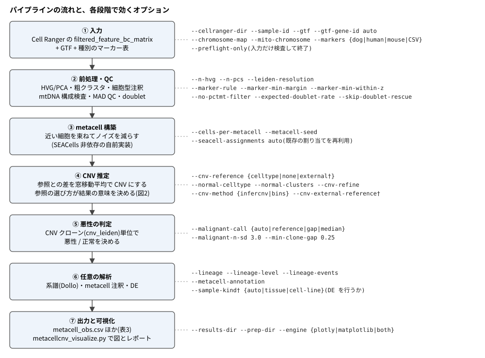
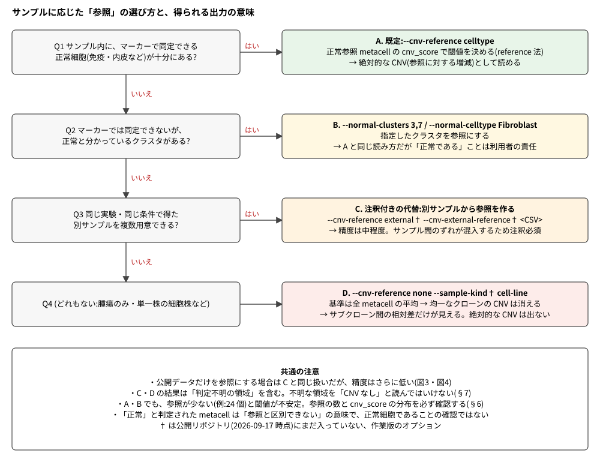
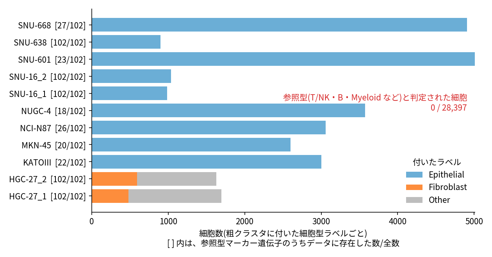
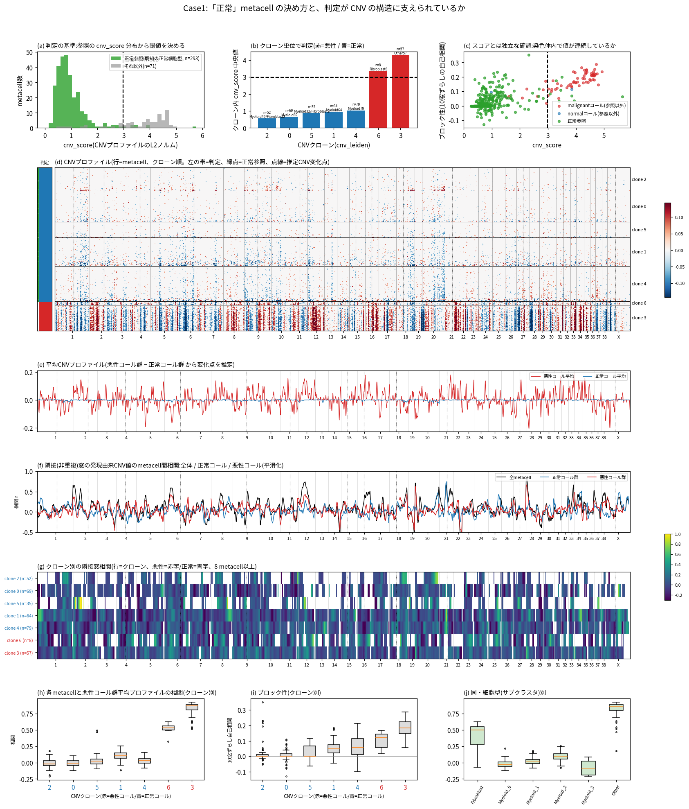
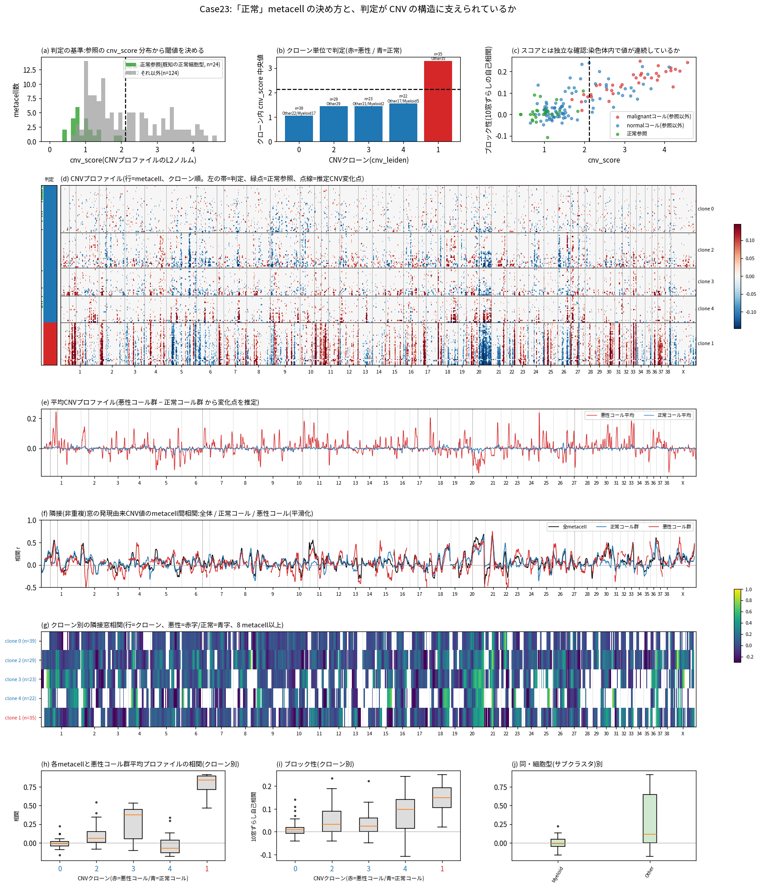
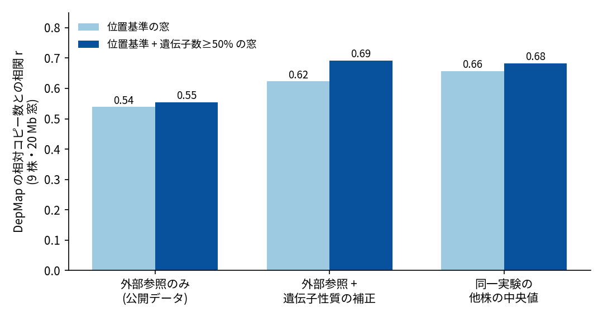
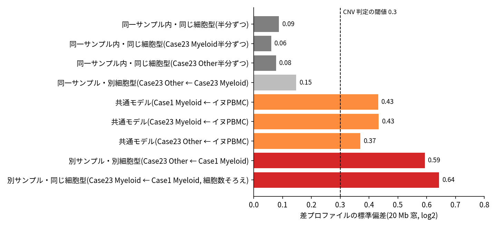

# metacellcnv 実行ガイド

**Cell Ranger の出力から出発して、どのオプションでどう走らせると、どんな意味の出力が得られるか。**

このガイドは、処理と校正が多段階になったパイプラインを「入力 → 選択 → 出力の意味」の順に整理したものです。
先に結論だけ知りたい場合は、§3(参照の選び方)と§8(結果を読むときのチェックリスト)を読んでください。

English version: [index.en.html](index.en.html) / [pipeline_guide.en.md](pipeline_guide.en.md)

## 0. このガイドの読み方

- **対象の版**: 作業版の `metacellcnv.py`(2026-09-29 時点)。オプション名・既定値は `--help` と実コードで確認しています。
- **†**: 公開リポジトリ(2026-09-17 時点のコミット)にまだ入っていない、作業版のオプション。該当するのは `--sample-kind`、`--cnv-reference external`、`--cnv-external-reference` と、外部参照を作る `build_external_cnv_reference.py` です。
- **状態の表記**: 各項目は次のいずれかです。
    - **[実装済み]**: パイプラインのオプションとして使える。
    - **[検証済み・未実装]**: 実データで効果を測ったが、パイプラインには組み込んでいない(§7)。
    - **[未検証]**: 未確認。
- 環境の用意は [INSTALL.md](https://github.com/takaho/metacellcnv/blob/main/INSTALL.md) を参照してください(Python 3.10 以上、scanpy など)。

## 1. 全体像

<figure>

<figcaption><b>図1. パイプラインの流れと、各段階で効くオプション。</b>
左の青い箱が処理段階、右の等幅文字がその段階で効くオプション。波括弧 <code>{a|b}</code> は選択肢、†は作業版のみ。
④の「参照」の選び方が、出力の意味をもっとも大きく変える(図2、§3)。</figcaption>
</figure>

パイプラインの考え方は次の通りです。

1. 細胞を **metacell**(近い細胞の束)にまとめてノイズを減らす。
2. metacell ごとに、**参照**との遺伝子発現の差を、染色体上の位置順に窓移動平均して **CNV**(コピー数変化)の推定値にする。
3. CNV の大きさ(`cnv_score`)でクローン(`cnv_leiden`)を悪性 / 正常に分ける。

つまり、**参照が何であるかが、そのまま「CNV とは何に対する増減か」を決めます**。

## 2. 入力の準備

| 入力 | 指定するオプション | 要点 |
|---|---|---|
| Cell Ranger 出力 | `--cellranger-dir` | `filtered_feature_bc_matrix/`(`matrix.mtx`、`barcodes.tsv`、`features.tsv` または `genes.tsv`。gzip の有無は問わない)。複数指定でき、その場合は `--sample-id` を同じ数だけ並べる |
| 遺伝子座標 | `--gtf`、`--gtf-gene-id auto` | 参照ゲノムと一致する GTF。遺伝子名の属性キーは GENCODE が `gene_name`、NCBI RefSeq が `gene`。`auto` で自動検出 |
| 染色体名の変換 | `--chromosome-map` | RefSeq の `NC_…` を `chr1…` に直す NCBI assembly report。GENCODE(`chr1…`)なら不要 |
| ミトコンドリア | `--mito-chromosome` | mtDNA の配列 ID。既知 ID(`chrM`、`MT`、`NC_002008.4` など)と GTF からの自動検出が既定で効く。イヌ CanFam6 は `NC_002008.4` |
| 細胞型マーカー表 | `--markers {dog,human,mouse,CSVのパス}` | 既定は `dog`。実データで検証済みなのは dog の Macrophage / Endothelial / Fibroblast / Epithelial の 4 パネルだけで、それ以外と human・mouse の表は命名の変換のみ(未検証のパネルでラベルを付けると警告が出る) |

実行の前に、入力の食い違いを次のコマンドで検査できます(重い処理は行いません)。

```bash
python metacellcnv.py --cellranger-dir <sample>/outs/filtered_feature_bc_matrix \
  --gtf genes.gtf --gtf-gene-id auto --markers human --preflight-only
```

検査するのは、必要ファイルの有無、遺伝子名と GTF の一致率、mtDNA 遺伝子の有無、マーカー遺伝子の有無、染色体名です。
一致率が低いときは `--gtf-gene-id` の値を疑ってください。

## 3. 参照の選び方(最重要)

<figure>

<figcaption><b>図2. サンプルに応じた「参照」の選び方と、得られる出力の意味。</b>
左の質問に「はい」なら右の方式(A〜C)、すべて「いいえ」なら D。
色は、A(緑)が最も確かで、D(赤)が最も制約が大きいことを表す。</figcaption>
</figure>

**表1. 参照の方式と、出力の意味**

| 方式 | 主なオプション | CNV の意味 | 失われるもの / 注意 |
|---|---|---|---|
| A. サンプル内の正常細胞を参照(既定) | `--cnv-reference celltype` | 正常参照に対する増減(絶対的な CNV) | 参照が少ないと閾値が不安定(§6) |
| B. 正常と分かっているクラスタを指定 | `--normal-clusters 3,7`、`--normal-celltype Fibroblast` | A と同じ | 指定したクラスタが本当に正常かは利用者の責任。Fibroblast / Epithelial は腫瘍そのものになりうるため、既定では参照にしない |
| C. 別サンプルを参照(†) | `--cnv-reference external --cnv-external-reference <CSV>` | 別サンプルに対する増減。サンプル間のずれが混入する | 精度は中程度(§7)。結果には必ず注釈を付ける |
| D. 全 metacell の平均を参照 | `--cnv-reference none`(単一株は `--sample-kind cell-line`†) | サブクローン間の**相対差**だけ | 均一なクローン全体の CNV は基準と同じ値になり、消える |

補足として、次の四点を押さえてください。

- **参照が 1 個もない**まま `--cnv-reference celltype`(既定)で走らせると、「正常参照が確保できません」で実行が止まります。腫瘍だけのサンプルでは `--cnv-reference none` を明示してください(止まるときのメッセージには、`--normal-clusters`、`--normal-celltype`、`--cnv-refine` も案内されます。`--cnv-refine` は 1 パス目で CNV が平坦だったクローンを参照にし直す方式で、均一な腫瘍には平坦なクローンがないため使えません)。
- **参照が 3 個未満**のとき、悪性判定は自動で gap 法(クローン中央値の最大ギャップで二分)に切り替わります。明確な二峰性がなければ判定を放棄し、全 metacell が `unassigned` になります。
    - **ただし CNV クローンが 2 個だけのときは、最大ギャップが必ずレンジの 100% になるため、判定が放棄されません。**
    - SNU-638(細胞株で全細胞が腫瘍)を `--cnv-reference none` で実行したところ、11 metacell が悪性 4 個・正常 7 個に分かれました。クローン中央値の差は 0.065 しかなく、`cnv_score` の範囲は両群で重なっていました(0.70〜1.30 と 0.88〜1.34)。
    - `INTERPRETATION_CAVEATS.txt` の総合判定も「重大な問題は検出されていません」と出ます。
    - **参照のない実行の `putative_malignant` は、腫瘍と正常の区別ではありません**。`cnv_score` による内部の二分に過ぎず、DE に使ってはいけません。
- `--sample-kind auto`(†、既定)は、参照 metacell が 3 個未満なら単一株相当とみなして DE をスキップします。CNV の判定自体はスキップされません。
- 判定に使う参照の定義と、腫瘍だけのサンプルで何個数えられるかは §6 にまとめました。

## 4. 実行例

最小限の流れは「検査 → 本体 → 可視化」の三段です。以下の `<…>` は自分の環境に置き換えてください。

**表2. 状況別の実行例**

| 状況 | コマンド(要点のみ) |
|---|---|
| イヌの腫瘍組織(免疫細胞などの正常細胞を含む) | `python metacellcnv.py --cellranger-dir <dir> --gtf <refseq.gtf> --gtf-gene-id gene --chromosome-map <assembly_report.txt> --mito-chromosome NC_002008.4 --markers dog --out-dir results/<sample>` |
| ヒトの細胞株(腫瘍のみ・単一株) | `python metacellcnv.py --cellranger-dir <dir> --gtf gencode.v50.annotation.gtf --gtf-gene-id auto --markers human --cnv-reference none --out-dir results/<sample>` |
| 参照だけを替えて再解析(metacell は再利用) | 上のコマンドに `--seacell-assignments results/<sample>/cell_to_metacell.csv` と、別の `--cnv-reference` を付けて別の `--out-dir` に出す |
| 別サンプルを参照にする(†) | 先に `python build_external_cnv_reference.py --cellranger-dir <参照1> --cellranger-dir <参照2> --out ref.csv` で擬似バルク参照を作り、本体に `--cnv-reference external --cnv-external-reference ref.csv` を付ける |
| 系譜も出す | 本体に `--lineage`(欠失事象のみを使う。既定 `--lineage-events loss`) |
| 図とレポート | `python metacellcnv.py --visualize --results-dir results/<sample> [--prep-dir prep/<sample>]` |

実行の前後で、次の習慣を勧めます。

1. **参照を替える比較は、必ず metacell を再利用する**(`--seacell-assignments`)。metacell の構成が揃うので、差が参照の違いだけになります。
2. **出力ディレクトリはオプションの組ごとに分ける**。`INTERPRETATION_CAVEATS.txt` と `malignant_call.txt` は実行ごとに内容が変わります。
3. 参照が 24 個のように少ないときは、`malignant_call.txt` に出る閾値と参照の `cnv_score` の分布(図6、図7の(a))を見てから結論を書く。

## 5. 出力ファイルの意味

**表3. 出力ファイル(`--out-dir` 直下)**

| ファイル | 内容 | 読み方の要点 |
|---|---|---|
| `metacell_obs.csv` | metacell ごとの表 | 下の表4を参照 |
| `malignant_call.txt` | 悪性判定の方法と根拠を 1 行で | 方法(reference 法 / gap 法)と閾値が書かれる |
| `INTERPRETATION_CAVEATS.txt` | この実行に固有の注意 | **必読**。複数検体を並べるときは各検体のものを読み比べる |
| `cnv_metacells.h5ad` | metacell × 窓の CNV 行列 | `obsm['X_cnv']` に CNV(スパース。動的閾値で小さい値は 0)、`uns['cnv']['chr_pos']` に染色体ごとの窓の開始位置 |
| `clone_chromosome_profiles.csv` | クローン × 染色体の平均 CNV | 図のヒートマップの元表。`--cnv-refine` を付けた場合は `_refined` 版も出る |
| `cell_to_metacell.csv` | バーコード → metacell の対応 | 再利用(`--seacell-assignments`)にも使う |
| `metacells.h5ad`、`singlecells_qc.h5ad` | metacell 集約後 / QC 後の単一細胞データ | 後者は大きい |
| `qc_metrics.csv`、`metacell_metrics.csv`、`metacell_mito_qc.csv`、`mito_gene_profile.csv` | QC と mtDNA の検査結果 | mtDNA 構成が不自然な検体は `--no-pctmt-filter` を検討 |
| `de_malignant_vs_normal.csv` | 悪性 vs 正常の DE | 単一検体の metacell は擬似反復で、p 値は推論に使えない。群が CNV で決まるため循環性もある |
| `cnv_lineage.nwk`、`cnv_lineage_branches.csv`、`cnv_lineage_events.csv`、`cnv_lineage_report.json` | 系譜(`--lineage` 時のみ) | `has_structure` が偽なら、木を系譜として読んではいけない |
| `environment.lock.txt` | 実行環境の記録 | 再現のために保管 |

**表4. `metacell_obs.csv` の主な列**

| 列 | 意味 |
|---|---|
| `n_cells`、`sample_id` | metacell を作る細胞数、由来サンプル |
| `cell_type` | マーカーによる細胞型。`Myeloid_0` のように粗クラスタ番号が付く。**参照かどうかの判定に使われる** |
| `cnv_score` | CNV プロファイルの L2 ノルム。大きいほど参照からのずれが大きい |
| `cnv_leiden` | CNV で分けたクローン。悪性 / 正常の判定はこの単位 |
| `putative_malignant` | `malignant` / `normal` / `unassigned`。`normal` は「参照と区別できない」の意味。**参照なしの実行(gap 法)では、腫瘍と正常の区別ではなく `cnv_score` の内部の二分** |
| `mito_*`、`ratio_outlier` ほか | mtDNA 由来の品質フラグ |

## 6. 判定の仕組みと、「参照」の定義

### 6.1 参照とは

**参照**は、マーカー遺伝子による細胞型注釈で「既知の正常細胞型」と判定されたクラスタの metacell です。

1. 粗クラスタ(Leiden)ごとに、マーカーセットのスコアを計算します。
2. 1 位と 2 位のスコア差(`--marker-min-margin`、既定 0.02)と、クラスタ内 z(`--marker-min-within-z`、既定 2.0)がともに閾値を超えたときだけ、その型を付けます。満たさなければ `Other` です。
3. 型が「正常参照に使う型」(マーカー表の `use_as_normal_reference`)なら、その metacell が参照です。`--markers dog|human|mouse` の表では、T/NK、B、Plasma、Myeloid、Macrophage、Mast、Endothelial、SmoothMuscle、Leukocyte の 9 型が参照に使えます。Fibroblast と Epithelial は入りません(`--normal-celltype` で追加できます)。

同じ参照集合が二か所で使われます。

- **CNV の基準**: 参照の平均発現を基準に、全 metacell の CNV を計算する。参照が 2 カテゴリ以上なら、参照の最小〜最大の範囲内を 0 とみなす方式(bounded)になる。
- **悪性判定の閾値**: 参照 metacell 自身の `cnv_score` の平均 + 3SD(`--malignant-n-sd`)。クローン中央値がこれを超えれば悪性。

参照は**発現マーカーで「正常らしい」と推定した細胞**であり、遺伝的に確認された正常細胞ではありません。
骨髄系の腫瘍のように、腫瘍そのものが参照型の細胞に見える場合は、CNV が参照と一緒に打ち消されて見えなくなります。

### 6.2 腫瘍だけのサンプルでは、参照は何個数えられるか

<figure>

<figcaption><b>図5. 腫瘍細胞だけを含む 11 サンプル(GSE142750、ヒト胃がん細胞株)に付いた細胞型ラベル。</b>
横軸は細胞数、色はラベル(青 Epithelial、橙 Fibroblast、灰 Other)。縦軸の [ ] 内は、参照型マーカー遺伝子 102 個のうちデータに存在した数。
参照型(T/NK、B、Myeloid など)と判定された細胞は 28,397 個中 0 個、metacell は 372 個中 0 個だった。</figcaption>
</figure>

**読み方に注意が要ります。** 11 サンプルのうち 6 サンプル(KATOIII、MKN-45、NCI-N87、NUGC-4、SNU-601、SNU-668)は、
公開された特徴量リストが約 1.3〜1.4 万遺伝子に絞られていて、参照型マーカー 102 個のうちデータに存在するのは 18〜27 個だけです(発現のない遺伝子が公開時に除かれたとみられ、免疫細胞のマーカーの多くが含まれていない)。
そのため、参照が 0 個になった結果を「判定規則が腫瘍細胞を参照と誤らなかった」ことの証拠として強く言えるのは、
マーカーが全部そろう残り 5 サンプル(HGC-27 の 2 つ、SNU-16 の 2 つ、SNU-638。計 6,248 細胞・80 metacell)に限られます。
6 サンプルでは、参照型のスコアは数個の遺伝子から計算されるため、参照を検出する力そのものが弱い状態です。

マーカーが全部そろう 5 サンプルでも、粗クラスタ 27 個のうち 2 個(HGC-27 の 363 細胞)は最高スコアが参照型(Macrophage)でしたが、
スコアは ±0.003 でほぼ 0 であり、判定規則(margin と z)で Other に落ちました。

参照が 0 個になったことには、二つの意味があります。

- 判定規則が保守的に働き、偽の参照が混ざらなかった(上の5サンプルで確認)。
- **サンプル内に参照がなければ、絶対的な CNV を出す手段がパイプライン内に残らない**(表1 の D)。

`--marker-min-margin` を 0 付近まで下げると、上の 363 細胞が Macrophage とされ、腫瘍細胞が参照に入る恐れがあります。

### 6.3 「正常」の判定が CNV の構造に支えられているか

<figure>

<figcaption><b>図6. Case1(イヌ腫瘍、364 metacell、参照 293 個)の「正常」metacell の決め方。</b>
(a) 参照(緑)の <code>cnv_score</code> 分布と閾値(破線、平均+3SD = 2.98)。(b) クローンごとの中央値。赤が悪性、青が正常。
(c) <code>cnv_score</code> とは独立な「ブロック性」(染色体内で 10 窓ずらした自己相関)との関係。
(d) CNV ヒートマップ(行は metacell をクローン順に並べたもの。左の帯が判定、点線が推定した変化点)。
(e) 悪性コール群と正常コール群の平均プロファイル。(f)(g) 重ならない窓どうしの相関(全体・群別・クローン別)。
(h)(i)(j) 悪性コール群の平均プロファイルとの相関、およびブロック性を、クローン別・細胞型別に示す。</figcaption>
</figure>

Case1 では、悪性コールと正常コールが明確に分かれました。悪性コールのブロック性の中央値は 0.17、正常コールは 0.016 です。
悪性コール群の下位 10% 点(相関 0.55)を超える正常コールは 299 個中 0 個でした。

<figure>

<figcaption><b>図7. Case23(イヌ腫瘍、148 metacell、参照 24 個)。</b>
パネルの意味は図6と同じ。(a) の参照が 24 個と少なく、閾値(2.13)の根拠は弱い。
(h) で、正常コールのクローン 3(23 個)の腫瘍パターンとの相関の中央値が 0.38 と高く、閾値直下に腫瘍様のクローンが残っている。</figcaption>
</figure>

Case23 では、正常コールの 113 個のうち 18 個が、悪性コール群の平均プロファイルとの相関 0.3 以上でした。
参照が少なく 1 細胞あたりの読み取りも少ない(約 426 遺伝子 / 細胞)ため、閾値付近でクローン単位に切ると、腫瘍細胞を含む混合 metacell や低純度の腫瘍クローンが「正常」に入りえます。

なお、重ならない隣接窓の相関(図6・図7 の (f)(g))は、群の内部では 0.04〜0.1 と低く、変化点をまたぐかどうかの差も一貫しません。
クローン内の metacell が似た状態でばらつきが小さいことが理由と考えています。判定の根拠として使えるのは、ブロック性と腫瘍パターンとの相関のほうです。
変化点は悪性コール群と正常コール群の差から自動推定したもので、実際の境界より粗い(参考扱い)。

## 7. 参照なし・別サンプル参照の信頼性(検証結果)

サンプル内に参照がない場合(表1 の C・D)に、どこまで CNV を信頼できるかを、正解のわかるデータで測りました。
**この節の方針は検証済みですが、パイプラインには未実装です**(再現用のスクリプトは作業ディレクトリの `_geo_cnv/` にあり、公開リポジトリには含めていません。結果の表は `docs/data/` にあります)。

### 7.1 検証の設計

- **データ**: GSE142750 の胃がん細胞株 9 株(ヒト hg38、chrM は除外)。11 サンプルのうち、同じ株の重複を 1 株にまとめて 9 株として評価した。結合データ(merged)は使っていない。
- **正解**: DepMap の `OmicsCNGene`(遺伝子ごとの相対コピー数)。log2(コピー数) を正解にし、20 Mb 窓で増幅 > 0.3、欠失 < −0.3 とした。
- **比較した参照**: (A) 公開データ(Tabula Sapiens など)から作った外部参照、(B) 同じ実験の**他の株**の中央値(評価する株を除いた残り 8 株)。

### 7.2 結果

<figure>

<figcaption><b>図3. 参照の種類と窓の作り方による、DepMap との相関(9 株、20 Mb 窓)。</b>
縦軸は DepMap の相対コピー数との相関 r。薄い青が位置基準の窓、濃い青が位置基準に「窓内の遺伝子数が期待の 50% 以上」を加えた窓。
外部参照のみ(0.54)より、遺伝子の性質(密度・長さ・参照の発現量)で補正した外部参照(0.62〜0.69)や、同一実験の他株の中央値(0.66〜0.68)が高い。</figcaption>
</figure>

1. **同一実験の他株の中央値(B)が、公開データの外部参照(A)より高い**(r 0.66 と 0.54)。公開データには、株に依存しない共通の偏り(例:chr19 が全 9 株で約 +0.9 log2)が入る。偏りは主に位置に依存するが、遺伝子単位ではばらつく。
2. **遺伝子の性質による補正で、A と B の差の約 7 割を埋められる**。補正には遺伝子密度・遺伝子長・参照の発現量を使い、対象の染色体を除いた学習(leave-chromosome-out)で行った。補正後の r は 0.62、遺伝子数の下限ルールを併用すると 0.69。
3. **窓は、位置基準でも遺伝子数基準でも検出性能は同等**だった。**位置基準で窓を切り、遺伝子が期待の 50% に満たない窓を除く**のが最良だった(r 0.69)。
4. **遺伝子の少ない窓(目安 20 遺伝子以下)は信頼できない**(r 0.43〜0.55)。
5. **組織間で変動の大きい遺伝子を除いても精度は上がらない**。50% 以上除くと共通成分がむしろ増えた(SD 0.43 → 0.55)。解像度だけが落ちる。

<figure>

<figcaption><b>図4. 正常細胞どうしを比べたときの差プロファイルの大きさ(20 Mb 窓)。</b>
横軸は差の標準偏差(log2)、破線は CNV 判定の閾値 0.3。灰は同一サンプル内、橙は共通モデル(イヌ PBMC)、赤は別サンプル。
別サンプルの差(0.59〜0.64)は、同一サンプル内(0.06〜0.15)の 4 倍以上で、CNV の判定閾値を超えている。</figcaption>
</figure>

6. **別サンプルを 1 つだけ対照にしても、CNV 検出には使えない**。Case1 と Case23 の正常細胞(同じ Myeloid)どうしでも、20 Mb 窓の差の標準偏差は 0.64 で、62% の窓で偏りが 0.3 を超えた。同一サンプル内では 0.06〜0.09 である。遺伝子の性質による補正で約半分(0.34)に下がるが、サンプル内の水準には届かない。
7. 他株の中央値(B)が効いたのは、**多数のサンプルの中央値を取るとサンプル固有のずれが平均化される**ためと考えている。イヌでは現状 2 サンプルしかなく、この点は未検証。

### 7.3 推奨する運用(確認済みの方針)

1. **窓は位置を基準にし、遺伝子の少ない窓は隣の窓とまとめて検出する**。遺伝子数が期待の 50% に満たない窓は、判定不能として扱う。
2. **組織依存の遺伝子だからといって除かない**。有意かどうかは位置基準の窓で判断する。
3. **参照の優先順位**: ①同一サンプル内の正常細胞(最も確か) > ②解析者が用意した、同じ実験の近い条件のサンプル(多数の中央値が望ましい) > ③公開データ(やむを得ない場合の代替で、必ず注釈を付ける)。
4. 公開データの代替として「入手できるデータ全体の平均」を使うと精度は低いが、性質の近い細胞なら有効な場合がある。
5. **判定不明の領域は、「CNV なし」と区別できる表示にする**。除去(不明扱い)が正当化されるのは、「CNV がない」と誤解されないように示す場合に限る。

[実装状況] 1〜5 は**未実装**です。現行の `--cnv-reference external` は、複数サンプルを合算した擬似バルク 1 本を参照にする方式で、検証した「他株の中央値」とは異なります。

## 8. 結果を読むときのチェックリスト

1. `INTERPRETATION_CAVEATS.txt` と `malignant_call.txt` を読んだか(方法・閾値・参照の数が書いてある)。
2. 参照 metacell は何個か。3 個未満なら gap 法になっていないか。24 個程度なら閾値は不安定(図7)。
3. 参照は本当に正常か。参照型が腫瘍そのものになりうる場合(例:骨髄系の腫瘍)は、CNV が打ち消される。
4. 悪性と正常の間に中間のクローンがないか(図6(b)、図7(b))。中間があれば、判定は閾値に左右されている。
5. 「正常」と判定されたクローンで、腫瘍パターンとの相関やブロック性が高くないか(図6・図7 の (h)(i))。
6. 参照が別サンプルや公開データなら、「判定不明の領域」と「サンプル間のずれ」を結果に明記したか(§7)。
7. 参照なし(表1 の D)の結果を、絶対的な CNV として書いていないか。見えているのはサブクローン間の相対差だけ。`malignant_call.txt` が gap 法なら、`putative_malignant` を腫瘍 vs 正常と読んでいないか(クローンが 2 個だと必ず二分される)。
8. DE の p 値を推論に使っていないか(擬似反復・循環性)。
9. 系譜は `has_structure` が真のときだけ読んでいるか。
10. 重要な結論は CopyKAT や SCEVAN など別の方法でも確認したか。

## 9. 既知の限界

- CNV は発現量からの推定で、DNA の測定ではない。遺伝子密度・遺伝子長・発現量に由来する偏りを含む(窓あたりの遺伝子が少ないほど不安定)。
- 均一な腫瘍(単一株の細胞株など)で参照が無いと、クローン全体の CNV は検出できない。サブクローン間の差しか見えない(表1 の D)。
- gap 法は、クローンが 2 個だと必ず二分する。腫瘍だけのサンプルでも「悪性」と「正常」が現れうる(§3)。この判定の妥当性を測る対照(例えば、ギャップの絶対的な大きさに閾値を設ける)は未実装。
- 1 細胞あたりの読み取りが少ないサンプル(例:Case23、約 426 遺伝子 / 細胞)では、詳細な解析に限界がある。「単純」な構造という意味ではない。
- 「正常」はマーカーによる推定で、遺伝的に確認されていない。参照型の細胞全体が共通の CNV を持つ場合(骨髄系の腫瘍など)は、サンプル内の解析では見えない。
- 一塩基多型のアレル比によるコピー数の確認は未実装。DNA レベルの確認や、同じ実験で得た真の正常細胞があれば、この限界は解消できる。
- 系譜(Dollo 節約法)は、構造の検定で支持されなければ解釈してはいけない(Case1・Case23 とも支持されなかった)。

## 10. トラブルシュート

| 症状 | 原因と対処 |
|---|---|
| 一致率が低い、座標が付かない遺伝子が多い | `--gtf-gene-id` の値(`gene` か `gene_name`)と、`features.tsv` の遺伝子名の形式を確認する。`--preflight-only` で再検査 |
| RefSeq のアクセッションが染色体名にならない | `--chromosome-map` に NCBI assembly report を渡す |
| mtDNA 遺伝子が見つからない警告 | Cell Ranger の参照に mtDNA が含まれていない可能性。pctMT による QC は機能しないので `--no-pctmt-filter` を付ける |
| 「正常参照が確保できません」で止まる | 参照型の細胞が 1 個もない。腫瘍だけのサンプルなら `--cnv-reference none` を明示する。正常と分かるクラスタがあれば `--normal-clusters` で指定する(§3) |
| 参照が少なく DE が出ない | 参照 metacell が 3 個未満だと単一株相当とみなして DE をスキップする(`--sample-kind`†)。CNV の判定は出力される |
| 悪性判定が全部 `unassigned` | gap 法で明確な二峰性がなく、判定を放棄した。クローンが 1 個のときも同じ。`--cells-per-metacell` を下げて解像度を上げるか、`--normal-clusters` で群を指定する |
| `cnv_metacells.h5ad` を anndata 0.11.4 で読むと `uns/log1p/base` で失敗する | 保存された `log1p` が null のため。ファイルを複製して `h5py` で `uns/log1p` を削除すれば読める |
| メモリ不足(約 4 GB の環境で doublet 検出が OOM になった例) | 細胞数の多いサンプルは、メモリに余裕のある環境で実行する |

## 付録:再現用の資料

**表5. `docs/` に置いたファイル**

| ファイル | 内容 |
|---|---|
| `pipeline_guide.md`、`index.html` | 本ガイド(日本語)の Markdown 版と HTML 版(同じ内容) |
| `pipeline_guide.en.md`、`index.en.html` | 英語版の Markdown 版と HTML 版(同じ内容) |
| `build_html.py` | Markdown から `index.html` と `index.en.html` を生成する |
| `make_diagrams.py` | 図1・図2(SVG)を生成する(`--lang ja\|en`) |
| `make_figures.py` | `docs/data/` の CSV から図3〜5を生成する(`--lang ja\|en`) |
| `make_call_figure.py` | `cnv_metacells.h5ad` と `metacell_obs.csv` から図6・図7(正常判定の根拠)を生成する(`--lang ja\|en`) |
| `data/pos_vs_count.csv` | 図3の元表(参照 × 窓の作り方 × 窓幅ごとの相関と AUC) |
| `data/cross_case2_null.csv` | 図4の元表(正常どうしの差の標準偏差) |
| `data/ref_count_clusters.csv`、`data/ref_count_samples.csv`、`data/geo_marker_coverage.csv` | 図5の元表(クラスタ・サンプルごとの細胞型ラベルと参照数、サンプルごとの参照型マーカーの存在数) |
| `img/`、`img/en/` | 図(日本語版と英語版)。`Case1_normal_call.png`、`Case23_normal_call.png` が図6・図7 |

正解データの DepMap(`OmicsCNGene.csv`、`Model.csv`)と GEO のデータ(GSE142750)は再配布していません。
